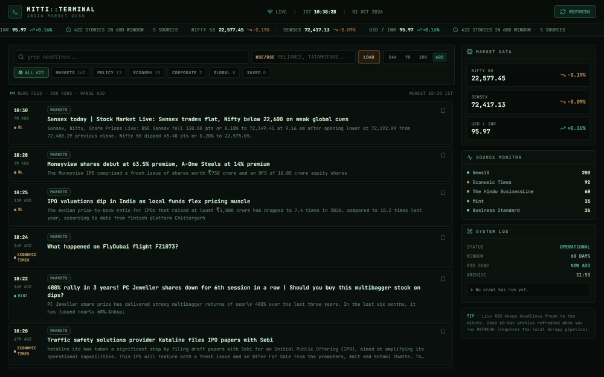

<div align="center">

```
███╗   ███╗ ██╗ ████████╗ ████████╗ ██╗
████╗ ████║ ██║ ╚══██╔══╝ ╚══██╔══╝ ██║
██╔████╔██║ ██║    ██║       ██║    ██║
██║╚██╔╝██║ ██║    ██║       ██║    ██║
██║ ╚═╝ ██║ ██║    ██║       ██║    ██║
╚═╝     ╚═╝ ╚═╝    ╚═╝       ╚═╝    ╚═╝   ::TERMINAL
```

**A pro trading terminal for the Indian markets — live indices, a 60-day news wire, and symbol-level intel, in one dark glass pane.**

[](https://nextjs.org)
[](https://react.dev)
[](https://www.typescriptlang.org)
[](https://tailwindcss.com)
[](./scraper)
[](#the-news-wire)
[](#data-freshness-policy)

*No API keys. No paywalls. No stale headlines. Just `pnpm dev` and the desk is open.*

<br/>



<sub>Live desk — the wire scrolling, MARKETS lens, and symbol mode pulling up `RELIANCE` with its quote + news.</sub>

</div>

---

## Why "Mitti"?

*Mitti* (मिट्टी) is Hindi for *soil* — and in India every ticker is downstream of the ground: monsoons, mandis, factories, festivals move markets before any analyst note does. This desk traces each headline back to that ground truth, so the name stays: **market news, in context — not just prices.**

---

## The Terminal

| | |
|---|---|
| 📈 **Live ticker tape** | NIFTY 50 · SENSEX · USD/INR streaming across the top, green/red, pause-on-hover |
| 📰 **Live news wire** | 6 publisher RSS feeds merged, deduped, newest-first — refreshed every 45s, never older than 60 days |
| 🔎 **Symbol mode** | Type any NSE/BSE symbol (`RELIANCE`, `INFY`, `TATAMOTORS…`) → live quote + that stock's news wire |
| 🧭 **Lenses & ranges** | MARKETS / POLICY / ECONOMY / CORPORATE / GLOBAL tabs, 24H → 60D range filters, `grep`-style search |
| 🔖 **Bookmarks** | Save stories to your personal desk pile |
| 🕷️ **Deep archive** | 7 Scrapy spiders for a full 60-day backfill — one click from the UI, or CLI |
| 🛡️ **Never blank** | Last-good caching + per-source timeouts: a flaky upstream degrades gracefully, never whitescreens |

---

## Architecture

```
            ┌────────────────────  BROWSER · Next.js 16 (React 19)  ────────────────────┐
            │   MITTI::TERMINAL — ticker tape · news feed · symbol mode · side panels   │
            └──────────────▲────────────────────────────────▲──────────────────────────┘
                   poll 45s│                        poll 20s│
            ┌──────────────┴───────────────┐    ┌───────────┴───────────┐
            │  /api/scraper                │    │  /api/rates           │
            │   ├─ live RSS · 6 sources    │    │   Yahoo Finance chart │
            │   ├─ CSV archive · 60d window│    │   NIFTY · SENSEX · FX │
            │   ├─ 5-min cache + last-good │    └───────────────────────┘
            │   └─ spawns background crawl │
            └──────────────▲───────────────┘
                  spawn    │
            ┌──────────────┴───────────────┐
            │  scraper/ · Scrapy (Py 3.10+)│
            │   7 publisher spiders        │
            │   → data/raw/*.csv (archive) │
            └──────────────────────────────┘

            /api/stock?symbol=RELIANCE  →  Yahoo quote (NSE/BSE)  +  Google News wire
```

**Freshness by design:** the RSS wire keeps headlines minutes old; the Scrapy archive fills the 60-day depth. A sliding window filter runs on *every* request, so the moment a story turns 60 days old it drops off the wire — no cleanup job, no stale rows, ever.

---

## Quickstart

**Prereqs:** Node 18+ · [pnpm](https://pnpm.io) · *(optional, for deep crawls)* Python 3.10+

```bash
git clone https://github.com/85599/mitti-markets.git
cd mitti-markets
pnpm install
pnpm dev
```

Open **http://localhost:3000** — the terminal boots with live indices and a live news wire. **No environment variables, no API keys, no setup wizard.** The Python scraper is entirely optional at runtime.

### Optional: deep 60-day archive (Scrapy)

```bash
cd scraper
python -m venv .venv
.venv\Scripts\activate        # Windows   (source .venv/bin/activate on macOS/Linux)
pip install -r requirements.txt

python -m india_news.cli --days 60 --output data --log-level WARNING
```

Or skip the CLI — hit **REFRESH** in the UI and the terminal spawns the crawl in the background, polling until the archive lands.

---

## API Reference

| Endpoint | Method | What it returns |
|---|---|---|
| `/api/scraper` | `GET` | Merged news wire: live RSS + 60-day CSV archive, deduped, newest-first (max 200) |
| `/api/scraper?refresh=1` | `GET` | Same, but forces an upstream RSS refetch |
| `/api/scraper` | `POST` | Kicks a background Scrapy crawl + RSS refresh; returns crawl state |
| `/api/rates` | `GET` | NIFTY 50 / SENSEX / USD-INR quotes (price, change, %change, staleness) |
| `/api/stock?symbol=X` | `GET` | Live NSE/BSE quote (with renamed-ticker resolution) + symbol news wire |

All endpoints are `no-store`, self-healing, and safe to poll.

---

## Project Structure

```
mitti-markets/
├── app/
│   ├── page.tsx              # the terminal — ticker, feed, symbol mode, panels
│   ├── layout.tsx            # JetBrains Mono, dark chrome, metadata
│   ├── globals.css           # terminal theme, ticker marquee, scrollbars
│   └── api/
│       ├── scraper/route.ts  # news wire: RSS + CSV archive + crawl control
│       ├── rates/route.ts    # index & FX quotes
│       └── stock/route.ts    # symbol quote + symbol news
├── lib/
│   └── rss.ts                # RSS fetch/parse, source registry, caching
└── scraper/                  # Scrapy package (Python 3.10+)
    └── india_news/
        ├── cli.py            # --days / --sources / --backfill entrypoint
        └── spiders/          # 7 publisher spiders
```

---

## Data Freshness Policy

1. **Live layer** — publisher RSS feeds, cached 5 min server-side, polled 45s client-side. Headlines land minutes after publication.
2. **Archive layer** — Scrapy CSVs, filtered to a sliding 60-day window on every request.
3. **Expiry** — the window slides in real time; stories auto-expire at day 60. There is no "old news" state to clean up.
4. **Grace** — if every upstream fails, the terminal serves the last good batch instead of an empty screen.

---

## Roadmap

- [ ] Watchlist alerts with browser notifications
- [ ] Per-symbol sentiment sparklines from the wire
- [ ] WebSocket push instead of polling
- [ ] Sector heat-map panel
- [ ] Export desk briefings to Markdown/PDF

---

## Contributing

Spots, feeds and spiders rot fast — PRs that keep them alive are the most valuable kind.

1. Fork → branch → commit
2. Keep the wire honest: no source that serves stale or paywalled content
3. Open a PR with what rotted and what you replaced it with

---

<div align="center">

**If this desk earns a place on your second monitor, leave it a ★ — it feeds the wire.**

*Built with mitti, for the mandis and the markets.*

</div>
